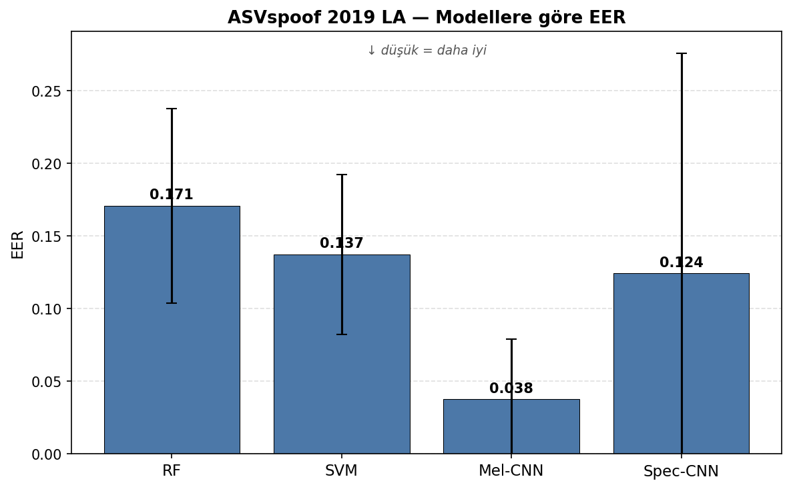
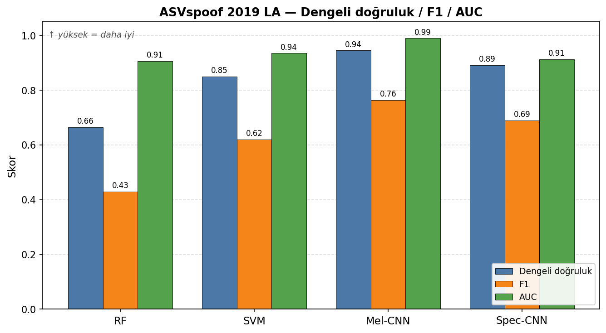

# Eğiticili Makine Öğrenmesi Yöntemleri ile Deepvoice Tahmini

Yıldız Teknik Üniversitesi — Bilgisayar Mühendisliği Bölümü, Bilgisayar Projesi.

Bu çalışmada, yapay zekâ tabanlı metinden-sese (TTS) ve ses dönüşümü sistemleriyle
üretilmiş sentetik konuşmanın gerçek insan sesinden ayırt edilmesi için geleneksel
makine öğrenmesi (Random Forest, SVM) ve derin öğrenme (CNN) modelleri geliştirilip
aynı protokol altında karşılaştırılmaktadır.

## Özet

İki ses öznitelik ailesi ve dört model değerlendirilmektedir:

- **Geleneksel ML:** 194 boyutlu öznitelik vektörü (MFCC istatistikleri, ZCR, spektral
  centroid/bandwidth/rolloff, RMS, chroma) üzerinde Random Forest ve SVM.
- **Derin öğrenme:** Mel-spektrogram ve standart spektrogram girdileri üzerinde,
  residual bloklar içeren bir CNN.

Modeller **saldırı-gruplu 5 katlı çapraz doğrulama** ile ölçülür: her katta modeller
o katta hiç görmedikleri saldırı türleriyle test edilir; böylece görülmemiş sentez
sistemlerine genelleme başarımı ölçülür. Ana metrik EER'dir; sınıf dengesizliği (~1:9)
nedeniyle dengeli doğruluk (BalACC) ve AUC de raporlanır.

## Sonuçlar (ASVspoof 2019 LA)

| Yöntem | EER | BalACC | AUC |
|---|---|---|---|
| Random Forest | 0.1708 ± 0.0671 | 0.6641 | 0.9066 |
| SVM | 0.1374 ± 0.0549 | 0.8500 | 0.9355 |
| CNN (Mel) | 0.0376 ± 0.0414 | 0.9450 | 0.9898 |
| CNN (Spec) | 0.1244 ± 0.1515 | 0.8916 | 0.9127 |

EER değerleri 5 katın ortalaması ± standart sapmadır; en iyi başarımı **CNN (Mel)**
verir. Tüm metrikler (Accuracy, Precision, Recall, F1) için:
[`results/asvspoof_results.md`](results/asvspoof_results.md).

### Grafikler

`tools/plot_results.py` sonuç CSV'sinden grafikleri üretir:

| Grafik | Açıklama |
|---|---|
|  | Modellere göre EER (düşük = daha iyi) |
|  | Dengeli doğruluk / F1 / AUC (yüksek = daha iyi) |

```bash
python tools/plot_results.py
```

## Klasör yapısı

```
.
├── app.py                  # Streamlit arayüzü (ses yükle → tahmin)
├── download_datasets.py    # Veri setlerini indirir ve düzenler
├── asvspoof/               # ASVspoof 2019 LA: öznitelik çıkarımı + ML/CNN eğitimi
│   ├── asvspoof_extract_features.py
│   ├── asvspoof_train_ml.py
│   ├── asvspoof_train_cnn.py
│   ├── asvspoof_train_spectrogram_cnn.py
│   ├── asvspoof_cnn_common.py
│   └── asvspoof_results.py
├── FoR/                    # Fake-or-Real: öznitelik çıkarımı + ML/CNN eğitimi
│   ├── extract_*_features.py
│   ├── train_*.py
│   └── generate_groups.py
├── tools/                  # compare_all_models.py, plot_results.py, test_features.py
├── experiments/            # asvspoof_attack_grouped_kfold.py (saldırı-gruplu değerlendirme)
├── results/                # Sonuç tabloları (.csv/.md)
├── features/               # Çıkarılan öznitelikler (.npy) — otomatik oluşur, depoya dâhil değil
├── logs/                   # Eğitim/çıkarım logları (.log) — otomatik oluşur, depoya dâhil değil
├── figures/                # Sonuç grafikleri (ek figürler gitignore'da)
├── models/                 # Eğitilmiş modeller (yalnız arayüzün kullandıkları)
├── requirements.txt        # Eğitim/çıkarım bağımlılıkları
└── requirements_gui.txt    # Arayüz bağımlılıkları
```

Büyük dosyalar (veri setleri, çıkarılan `.npy` öznitelikleri, sanal ortam) depoya
dâhil değildir; bkz. `.gitignore`. **Tüm betikler proje kök dizininden çalıştırılır.**

## Kurulum

```bash
python -m venv .venv
source .venv/bin/activate
pip install -r requirements.txt
```

## Veri setleri

Veri setleri depoya dâhil değildir. İndirme betiği doğru klasör yapısını kurar:

```bash
python download_datasets.py all        # veya: asvspoof / for
```

- **ASVspoof 2019 LA:** [Edinburgh DataShare](https://datashare.ed.ac.uk/handle/10283/3336)
  üzerinden doğrudan indirilir → `Dataset/ASVspoof2019_LA/`.
- **The Fake-or-Real (FoR):** Kaggle aynası üzerinden indirilir (`kaggle` aracı + API
  anahtarı gerekir) → `Dataset/for-original/`. Kaynak:
  [York Üniversitesi BIL](https://bil.eecs.yorku.ca/datasets/).

## Çalıştırma

Öznitelik çıkarımı ve değerlendirme (proje kökünden çalıştırın):

```bash
# 1) Öznitelikler (ML / Mel / Spec)
python asvspoof/asvspoof_extract_features.py     # veya --ml-only / --mel-only / --spec-only

# 2) Saldırı-gruplu 5 katlı çapraz doğrulama (dört model)
python experiments/asvspoof_attack_grouped_kfold.py   # veya --ml-only / --cnn-only

# 3) Sonuç grafikleri
python tools/plot_results.py
```

Sonuçlar `results/asvspoof_results.csv` (+`.md`) dosyasına yazılır.

Arayüz:

```bash
pip install -r requirements_gui.txt
streamlit run app.py
```

Arayüzde model seçilir, ses dosyası (`.wav/.mp3/.flac`) yüklenir; sistem gerçek/sentetik
kararını, güven skorunu ve dalga formu / mel-spektrogram görselini gösterir.
