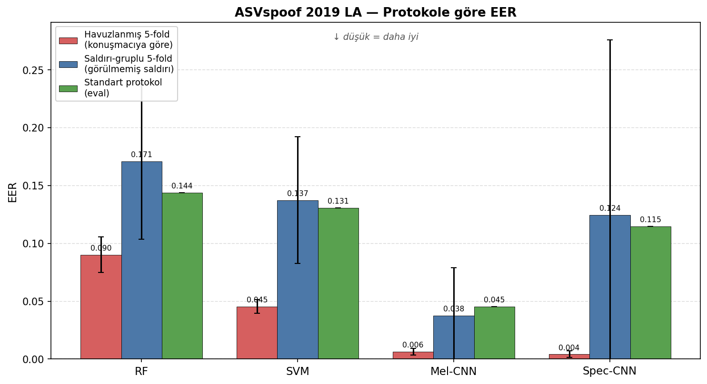
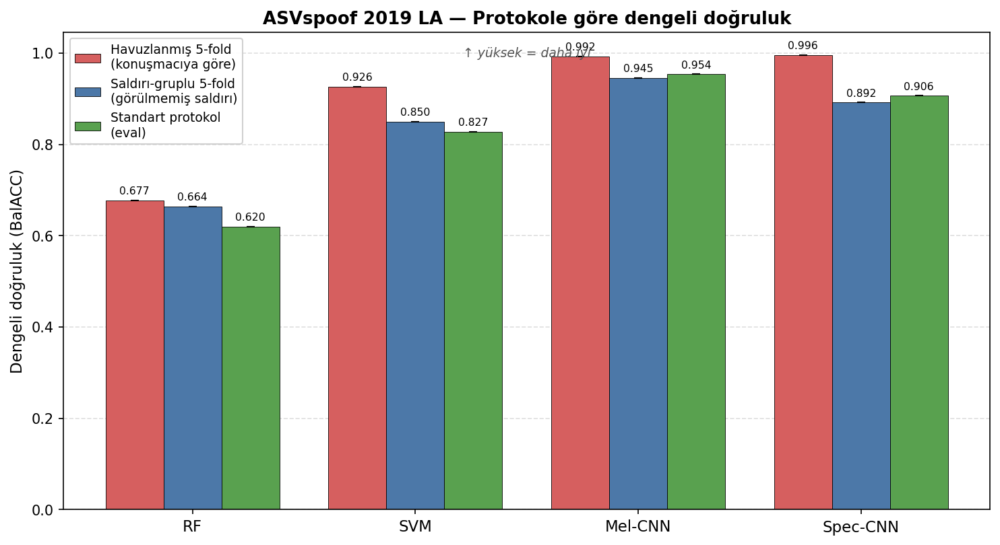
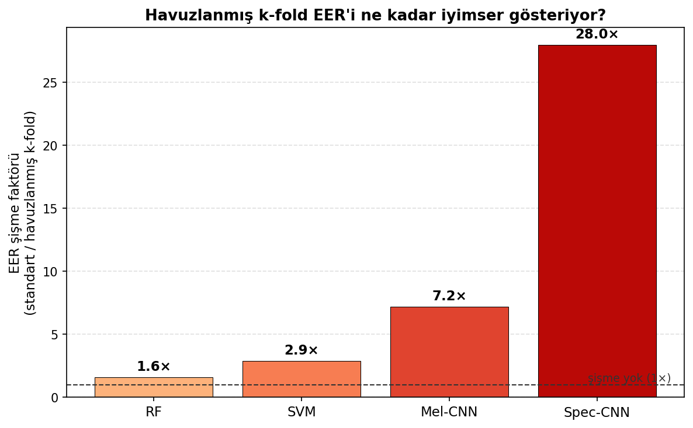

# Eğiticili Makine Öğrenmesi Yöntemleri ile Deepvoice Tahmini

Yıldız Teknik Üniversitesi — Bilgisayar Mühendisliği Bölümü, Bilgisayar Projesi.

Bu çalışmada, yapay zekâ tabanlı metinden-sese (TTS) ve ses dönüşümü sistemleriyle
üretilmiş sentetik konuşmanın gerçek insan sesinden ayırt edilmesi için geleneksel
makine öğrenmesi (Random Forest, SVM) ve derin öğrenme (CNN) modelleri geliştirilip
aynı protokol altında karşılaştırılmaktadır.

## Özet

İki ses öznitelik ailesi ve dört model değerlendirilmektedir:

- **Geleneksel ML:** 194 boyutlu öznitelik vektörü (MFCC istatistikleri, ZCR, spektral
  centroid/bandwidth/rolloff, RMS, chroma) üzerinde Random Forest ve SVM.
- **Derin öğrenme:** Mel-spektrogram ve standart spektrogram girdileri üzerinde,
  residual bloklar içeren bir CNN.

Modeller üç değerlendirme protokolüyle ölçülür: **havuzlanmış 5 katlı çapraz
doğrulama** (konuşmacıya göre GroupKFold), **saldırı-gruplu 5 katlı çapraz doğrulama**
(her katta görülmemiş saldırı türleri) ve **standart protokol** (train→dev→eval; hem
görülmemiş konuşmacı hem görülmemiş saldırı). Ana metrik EER'dir; sınıf dengesizliği
(~1:9) nedeniyle dengeli doğruluk (BalACC) ve AUC de raporlanır.

## Sonuçlar (ASVspoof 2019 LA, EER)

| Yöntem | Havuzlanmış k-fold | Saldırı-gruplu k-fold | Standart protokol (eval) |
|---|---|---|---|
| Random Forest | 0.0902 | 0.1708 | 0.1437 |
| SVM | 0.0454 | 0.1374 | 0.1306 |
| CNN (Mel) | 0.0063 | 0.0376 | 0.0453 |
| CNN (Spec) | 0.0041 | 0.1244 | 0.1146 |

Havuzlanmış k-fold konuşmacıya göre bölünse de, saldırı türü train/test arasında
sızdığı için iyimser EER üretir; bu şişme model kapasitesiyle büyür (RF ~1.6×,
Spec-CNN ~28×). Saldırı-gruplu k-fold ile standart protokol birbirine yakındır ve
gerçekçi başarımı verir. Ayrıntılı tablolar:
[`results/asvspoof_results.md`](results/asvspoof_results.md).

### Grafikler

`tools/plot_protocol_comparison.py` sonuç CSV'sinden üç grafiği üretir:

| Grafik | Açıklama |
|---|---|
|  | Protokole göre EER (düşük = daha iyi) |
|  | Protokole göre dengeli doğruluk |
|  | Havuzlanmış k-fold'un yarattığı EER şişmesi |

```bash
python tools/plot_protocol_comparison.py
```

## Klasör yapısı

```
.
├── app.py                  # Streamlit arayüzü (ses yükle → tahmin)
├── download_datasets.py    # Veri setlerini indirir ve düzenler
├── asvspoof/               # ASVspoof 2019 LA: öznitelik çıkarımı + ML/CNN eğitimi
│   ├── asvspoof_extract_features.py
│   ├── asvspoof_train_ml.py
│   ├── asvspoof_train_cnn.py
│   ├── asvspoof_train_spectrogram_cnn.py
│   ├── asvspoof_cnn_common.py
│   └── asvspoof_results.py
├── FoR/                    # Fake-or-Real: öznitelik çıkarımı + ML/CNN eğitimi
│   ├── extract_*_features.py
│   ├── train_*.py
│   └── generate_groups.py
├── tools/                  # compare_all_models.py, plot_protocol_comparison.py, test_features.py
├── experiments/            # Yan analizler
├── results/                # Sonuç tabloları (.csv/.md)
├── features/               # Çıkarılan öznitelikler (.npy) — otomatik oluşur, depoya dâhil değil
├── logs/                   # Eğitim/çıkarım logları (.log) — otomatik oluşur, depoya dâhil değil
├── figures/                # Protokol-karşılaştırma grafikleri (k-fold figürleri gitignore'da)
├── models/                 # Eğitilmiş modeller (yalnız arayüzün kullandıkları)
├── requirements.txt        # Eğitim/çıkarım bağımlılıkları
└── requirements_gui.txt    # Arayüz bağımlılıkları
```

Büyük dosyalar (veri setleri, çıkarılan `.npy` öznitelikleri, sanal ortam) depoya
dâhil değildir; bkz. `.gitignore`. **Tüm betikler proje kök dizininden çalıştırılır.**

## Kurulum

```bash
python -m venv .venv
source .venv/bin/activate
pip install -r requirements.txt
```

## Veri setleri

Veri setleri depoya dâhil değildir. İndirme betiği doğru klasör yapısını kurar:

```bash
python download_datasets.py all        # veya: asvspoof / for
```

- **ASVspoof 2019 LA:** [Edinburgh DataShare](https://datashare.ed.ac.uk/handle/10283/3336)
  üzerinden doğrudan indirilir → `Dataset/ASVspoof2019_LA/`.
- **The Fake-or-Real (FoR):** Kaggle aynası üzerinden indirilir (`kaggle` aracı + API
  anahtarı gerekir) → `Dataset/for-original/`. Kaynak:
  [York Üniversitesi BIL](https://bil.eecs.yorku.ca/datasets/).

## Çalıştırma

Öznitelik çıkarımı ve eğitim:

```bash
# ASVspoof (proje kökünden çalıştırın)
python asvspoof/asvspoof_extract_features.py --ml-only     # veya --mel-only / --spec-only
python asvspoof/asvspoof_train_ml.py
python asvspoof/asvspoof_train_cnn.py
python asvspoof/asvspoof_train_spectrogram_cnn.py
```

Arayüz:

```bash
pip install -r requirements_gui.txt
streamlit run app.py
```

Arayüzde model seçilir, ses dosyası (`.wav/.mp3/.flac`) yüklenir; sistem gerçek/sentetik
kararını, güven skorunu ve dalga formu / mel-spektrogram görselini gösterir.
